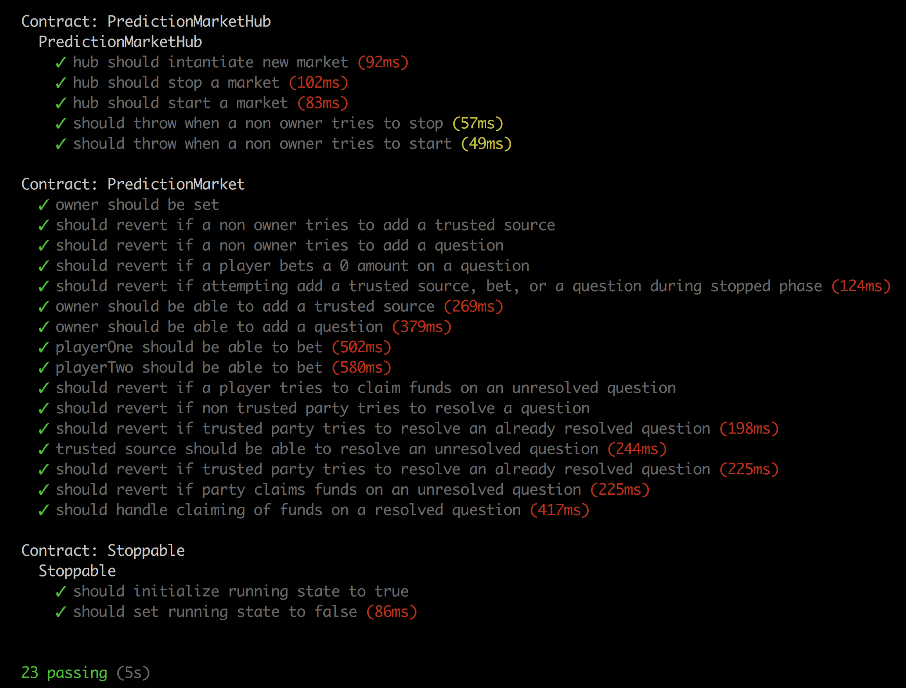

# A decentralized prediction market

## The project will start as a database whereby:

- as an administrator, you can add a yes/no question.
- as a regular user you can bet on an outcome of the question.
- as a trusted source, you can resolve the question.
- as a regular user, you can trigger the mutual-based payouts.

## Eventually, will refactor it to include:

- a front end
- access to oracles.
- market-making.

## Currently passes the following tests

